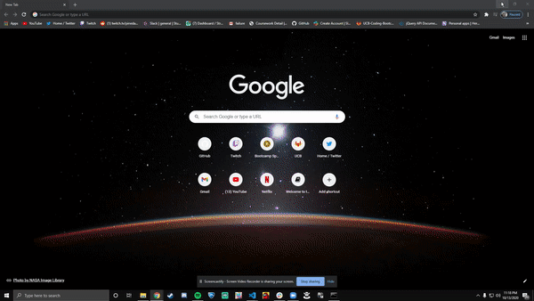
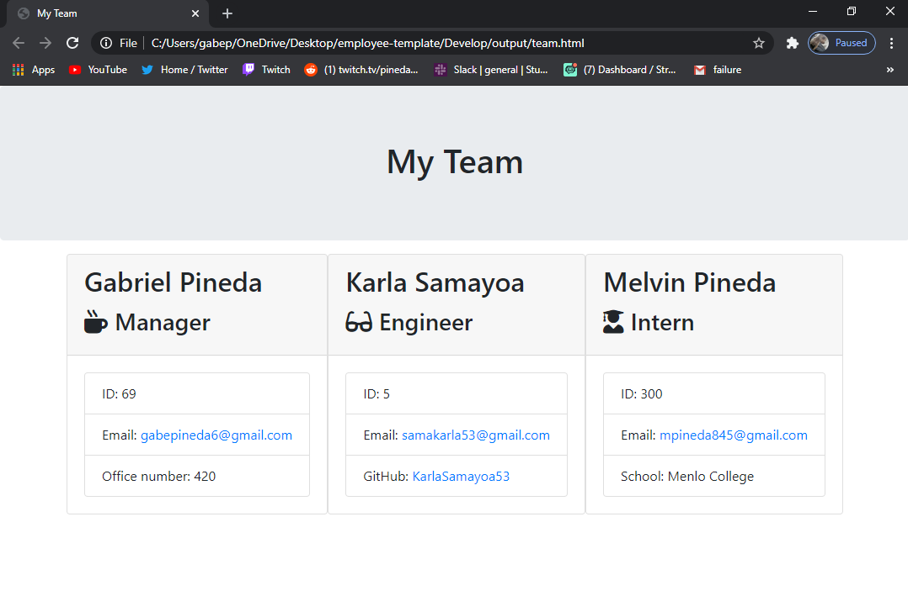
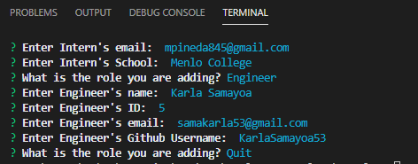

# Employee Template
In this project i was able to successfully create an html website that autmates adding emplyees and their information to the websites card in which they display cleanly and we were able to get this information uisng inquirer in order to rpompt the user to give the data on each employee and add as many employees as wanted.

## How to use the app

## Image of the Website

## Built With

* [Javascript](https://www.javascript.com/)
* [HTML](https://developer.mozilla.org/en-US/docs/Web/HTML)
* [Node.js](https://nodejs.org/en/)
* [NPM](https://www.npmjs.com/)
* [NPM Inquirer](https://www.npmjs.com/package/inquirer)

## Code Snippet
    The code below is what most of the other manager, intern, and engineer code extend from and is how we take in the specific informatio nfrom the user and apply it to the html and it is useful as we do not have to repeat code.

    class Employee{
    constructor(name,id,email){
        this.name = name;
        this.id = id;
        this.email = email;
        this.role = "Employee"
    }
    getName(){
        return this.name
    }
    getId(){
        return this.id
    }
    getEmail(){
        return this.email
    }
    getRole(){
        return this.role
    }
}

module.exports = Employee;

## Github Repository
- [Employee Template Repo](https://github.com/GabrielPineda808/employee-template)
## Authors

* **Gabriel Pineda** 

- [Link to Github](https://github.com/GabrielPineda808)
- [Link to LinkedIn](https://www.linkedin.com/in/gabriel-pineda-a94535195/)